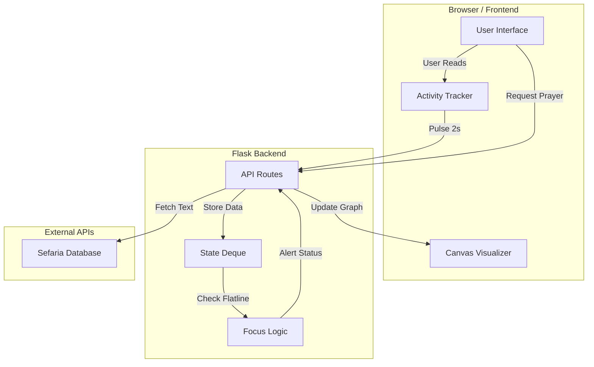
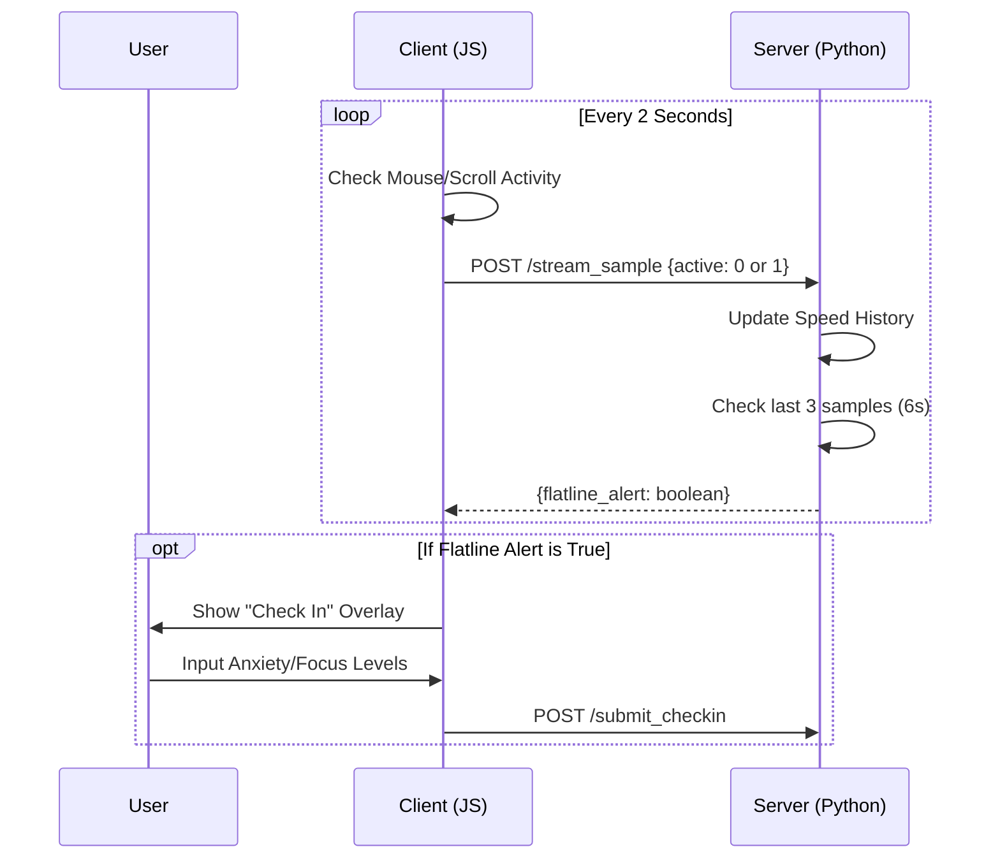

# kohelet2026
Repo for collaboration on the Kohelet 2026 coding competition.

## Architecture & Logic

### System Overview
The application follows a client-server model. The frontend handles the prayer interface and biometric simulation (mouse/scroll tracking), while the Flask backend maintains state and connects to external APIs.

### "Nudge" Logic Flow
The system monitors user engagement in 2-second intervals. If the user becomes idle (flatlines) for too long, the system triggers a check-in.

